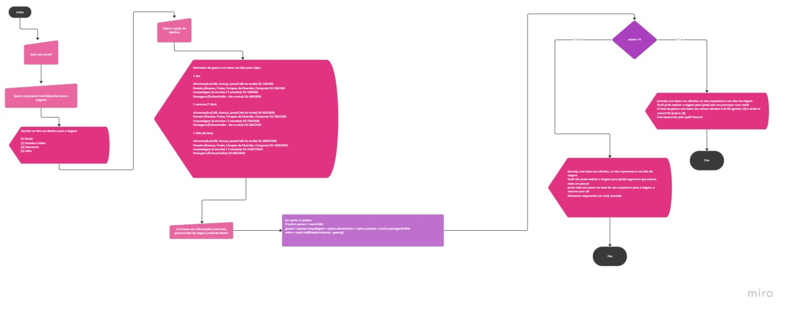

# unicsul-atividade3
Este repositório é para fins acadêmicos, não sendo considerado como portfólio. Algoritmo, código e fluxograma da Atividade 3 - Pensamento Computacional

## Integrantes

* Pietra Duccini
* Gabriel Bizzi
* Manuella Caputo

## Algoritmo

O programa inicia-se solicitando ao usuário o seu nome, para que seja apresentado na saída do programa, posteriormente, irá fazer uma série de perguntas sobre a viagem a ser feita, seguindo essa lógica, o programa faz a primeira pergunta, questionando ao usuário qual o orçamento total disponível para a viagem, armazenando o valor em float, aceitando numeros decimais, depois, o programa apresentará uma lista de lugares para viajar, após o usuário escolher a opção que deseja, o programa em seguida irá apresentar algumas informações com estimativa de dias, semanas e mês, entre os gastos durante a viagem. Depois de apresentar essa informação, o programa irá perguntar quantos dias irá durar a viagem - com base na informação fornecida pelo usuário, o programa irá cálcular o orçamento médio de acordo com os dias inseridos pelo usuário, apresentando se o mesmo está apto para realizar a viagem com tranquilidade além de, apresentar as estimativas de gatos baseado nos dias da viagem, após a apresentação das informações, o programa se encerrará.

## Fluxograma

  
  
  
  

